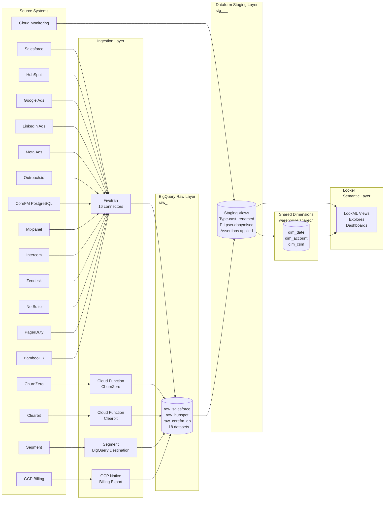

# Pipeline Architecture — Foundation
## Core Dynamics Data Platform Build — Release 02

**Prepared by:** Wire Autopilot
**Date:** 2026-03-29
**Release:** 02-foundation (pipeline_only)

---

## 1. Architecture Overview

The Core Dynamics data pipeline follows an ELT (Extract, Load, Transform) pattern on Google Cloud:

1. **Extract & Load** — Fivetran (16 connectors) and custom Cloud Functions (ChurnZero, Clearbit) land raw data into BigQuery raw datasets
2. **Transform** — Dataform builds staging → integration → warehouse layers in BigQuery
3. **Orchestrate** — Cloud Composer 2 (Airflow) triggers syncs, runs transformations, and monitors quality
4. **Serve** — Looker reads exclusively from the warehouse layer via the LookML semantic layer

### Architecture Principles

- **Raw data immutability**: Raw datasets are written by Fivetran/Cloud Functions only. No direct writes by Dataform.
- **Layer separation**: Each layer (raw, staging, integration, warehouse) has its own BigQuery dataset.
- **Source-aligned naming**: Raw datasets are named `raw_<source>` (e.g., `raw_salesforce`). Staging models follow `stg_<source>__<entity>`.
- **Fail-safe design**: Pipeline failures alert via Slack/email; downstream layers do not update until upstream assertions pass.
- **PII at the perimeter**: PII pseudonymisation applied in staging models; no PII propagates to integration or warehouse layers.

---

## 2. Source System Analysis

### Group A — Standard Fivetran Connectors (incremental, managed)

| Source | Fivetran Connector | Sync Type | Frequency | Schema Complexity | PII |
|---|---|---|---|---|---|
| Salesforce | salesforce | Incremental + history mode | Every 6 hours | High (200+ objects, using selective sync) | Low (account/contact names — acceptable in staging) |
| HubSpot | hubspot | Incremental | Every 1 hour | Medium | Low |
| Google Ads | google_ads | Incremental | Daily 3am UTC | Low-medium | None |
| LinkedIn Ads | linkedin_ads_source | Incremental | Daily 3am UTC | Low | None |
| Meta Ads | facebook_ads | Incremental | Daily 3am UTC | Low-medium | None |
| Outreach.io | outreach | Incremental | Every 6 hours | Medium | Low (email addresses in contact records) |
| Mixpanel | mixpanel | Incremental | Daily 4am UTC | Medium | None (pseudonymised user IDs) |
| Intercom | intercom | Incremental | Every 6 hours | Medium | Low (user names/emails in contact records) |
| Zendesk | zendesk_support | Incremental | Every 1 hour | Medium | Low (customer names in tickets) |
| NetSuite | netsuite_suiteanalytics | Incremental | Daily 5am UTC | High (requires dedicated integration role — 2–3 week provisioning) | Low |
| PagerDuty | pagerduty | Incremental | Every 1 hour | Low | None |
| BambooHR | bamboohr | Incremental | Daily 5am UTC | Low-medium | High (HR data — employees, salaries) |

**Design decision:** BambooHR data contains high-sensitivity PII (employee salary data). Only headcount and team structure columns (`employee_id`, `department`, `team`, `hire_date`) will be selected at the Fivetran layer. Salary and personal data excluded from sync via Fivetran column blocklist.

### Group B — Streaming Destination

| Source | Method | Sync Type | Frequency | Notes |
|---|---|---|---|---|
| Segment | Segment BigQuery Destination | Streaming (append-only) | Real-time | Deduplication required in staging — overlaps with Mixpanel events. Requires Leon Yip event-to-source mapping. |

**Design decision:** Segment and Mixpanel will have independent staging models. A deduplication intermediate model (`int__product_events__deduplicated`) will be built in Release 04 to resolve overlaps. The staging layer will not attempt deduplication — that logic belongs in integration.

### Group C — Custom Connectors

| Source | Method | Trigger | Notes |
|---|---|---|---|
| ChurnZero | Cloud Function → BigQuery | Daily 6am UTC (scheduled) | No native Fivetran connector. Cloud Function calls ChurnZero REST API with incremental sync (stores last_sync_timestamp in GCS). Retry logic with exponential backoff. |
| Clearbit | Cloud Function → BigQuery | HubSpot webhook on new lead | Triggered on `contact.created` webhook from HubSpot. Enriches contact with company firmographics. Rate-limited (Clearbit Business: 20 req/sec). Queue via Pub/Sub for burst handling. |

### Group D — Native Google Integrations

| Source | Method | Frequency | Notes |
|---|---|---|---|
| GCP Billing Export | Native BigQuery Export | Daily (T+1) | Already partially configured by Sean Murphy. Rittman Analytics to formalise dataset structure and validate completeness. |
| Google Cloud Monitoring | Cloud Monitoring API → Dataform | Daily | Custom Dataform pipeline calling Cloud Monitoring API for uptime metrics and error rates. Lands in `raw_cloud_monitoring`. |

### Group E — CDC Connector

| Source | Method | Frequency | Special Considerations |
|---|---|---|---|
| CoreFM PostgreSQL | Fivetran Log-based CDC | Near real-time (15 min) | Network access via Cloud SQL Auth Proxy. PII present — user emails, names. Pseudonymisation at staging layer (user_id one-way hash). Legal sign-off (Diane Hooper) required before implementation. Read-only replica to be used (not production write primary). |

---

## 3. BigQuery Dataset Architecture

```
GCP Project: core-dynamics-analytics-prod
│
├── raw_salesforce/          ← Fivetran landing zone
├── raw_hubspot/
├── raw_google_ads/
├── raw_linkedin_ads/
├── raw_meta_ads/
├── raw_outreach/
├── raw_clearbit/
├── raw_corefm_db/           ← CoreFM PostgreSQL CDC landing
├── raw_mixpanel/
├── raw_segment/             ← Segment streaming destination
├── raw_intercom/
├── raw_churnzero/           ← ChurnZero Cloud Function landing
├── raw_zendesk/
├── raw_netsuite/
├── raw_pagerduty/
├── raw_gcp_billing/
├── raw_cloud_monitoring/
├── raw_bamboohr/
│
├── staging/                 ← Dataform staging layer (views)
│   ├── stg_salesforce__accounts
│   ├── stg_salesforce__contacts
│   ├── stg_salesforce__opportunities
│   └── ... (all sources)
│
├── integration/             ← Dataform integration layer (views/tables)
│   ├── int__account
│   ├── int__contact
│   └── ... (cross-source joins)
│
├── warehouse/               ← Dataform warehouse layer (tables, partitioned)
│   ├── mart_marketing/
│   ├── mart_product/
│   ├── mart_customer/
│   ├── mart_ops/
│   └── shared/ (dim_date, dim_account, dim_csm)
│
└── monitoring/              ← Pipeline health metadata
    ├── pipeline_run_log
    └── assertion_results
```

**Partitioning strategy:**
- All fact tables partitioned by `DATE` column (daily granularity)
- High-volume tables (fct_feature_usage, fct_attribution_touches, fct_session_events) clustered by `account_id`
- Staging views are not partitioned (source tables handle this)

---

## 4. Staging Model Specifications

All staging models follow this standard structure:

```sql
-- stg_<source>__<entity>.sql
config {
  type: "view",
  schema: "staging",
  description: "[entity] from [source], cleaned and typed",
  columns: { ... }
}

WITH source AS (
  SELECT * FROM ${ref("<raw_table>")}
),

renamed AS (
  SELECT
    -- surrogate key
    {{ dbt_utils.generate_surrogate_key(['natural_key_col']) }} AS <entity>_pk,
    -- business key
    <natural_key_col> AS <entity>_id,
    -- timestamps
    CAST(<created_at> AS TIMESTAMP) AS created_at_ts,
    CAST(<updated_at> AS TIMESTAMP) AS updated_at_ts,
    -- ... all other columns, renamed to snake_case
    _fivetran_synced AS _synced_at
  FROM source
  WHERE _fivetran_deleted IS FALSE OR _fivetran_deleted IS NULL
)

SELECT * FROM renamed
```

**Key conventions:**
- Surrogate keys: `<entity>_pk` (SHA-256 hash of natural key)
- Foreign keys: `<referenced_entity>_fk`
- Timestamps: `<event>_ts` suffix, always TIMESTAMP type
- Booleans: `is_` or `has_` prefix
- All column names in snake_case, lowercase
- `_fivetran_deleted` filter applied to all incremental sources

**CoreFM PostgreSQL special handling:**
```sql
-- PII pseudonymisation at staging layer
SHA256(CAST(user_id AS STRING)) AS user_id_hash,  -- one-way hash, NOT the original user_id
-- user_email, user_name columns are NOT selected
account_id AS account_id  -- retained as the join key to Salesforce
```

---

## 5. Dataform Assertions

Every staging and shared dimension model will have the following assertions:

| Assertion Type | Targets | Failure Action |
|---|---|---|
| `not_null` | All `_pk` columns, all `_fk` columns, critical business keys | Alert + pipeline pause for that model |
| `unique` | All `_pk` columns | Alert + pipeline pause |
| `referential_integrity` | FK → PK across related models (e.g., `opportunity_fk` → `accounts_pk`) | Warning alert (non-blocking) |
| `row_count_threshold` | All tables: row count must be > 0; must be within ±20% of previous day's count | Alert if threshold breached |
| `business_sanity` | ARR must be ≥ 0; probability fields must be 0–1; dates must be in plausible range (not before 2000, not after current date + 1 year) | Warning alert |
| `freshness` | Each source must have at least one row with `_synced_at` within the expected sync window + 2× buffer | Alert if stale |

---

## 6. Cloud Composer Orchestration

### DAG Architecture

```
DAG: core_dynamics_daily_pipeline
├── trigger_fivetran_syncs_group
│   ├── trigger_salesforce_sync
│   ├── trigger_hubspot_sync
│   ├── trigger_zendesk_sync
│   ├── trigger_pagerduty_sync
│   ├── ... (all 16 Fivetran connectors, grouped by priority)
│   └── wait_for_syncs_complete
│
├── trigger_custom_connectors_group
│   ├── trigger_churnzero_cloud_function
│   └── wait_for_custom_connectors
│
├── run_dataform_staging
│   └── dataform_run: tag=staging
│
├── run_dataform_quality_checks
│   └── dataform_run: tag=assertions
│
├── notify_on_assertion_results
│   ├── [if all pass] → trigger_dataform_warehouse
│   └── [if any fail] → alert_slack_channel
│
└── trigger_dataform_warehouse
    └── dataform_run: tag=warehouse
```

**Scheduling:** Nightly full refresh at 2am UTC. Intraday incremental for high-priority tables (Salesforce, HubSpot, Zendesk, CoreFM): every 6 hours.

**Failure handling:**
- Task-level retries: 2 retries with 5-minute exponential backoff
- Fivetran sync failures: alert Slack + mark downstream tasks as skipped (not failed)
- Dataform assertion failures: alert Slack + block warehouse refresh for affected source
- Cloud Function failures: alert Slack + retry via Cloud Tasks queue

---

## 7. Data Flow Diagram



---

## 8. Technology Stack

| Component | Technology | Version / Notes |
|---|---|---|
| Data Warehouse | Google BigQuery | Standard/Enterprise edition with column-level security |
| Ingestion (standard) | Fivetran | Business Critical account; 16 standard connectors |
| Ingestion (custom) | Google Cloud Functions (Gen 2) | Python 3.11; ChurnZero and Clearbit connectors |
| Ingestion (streaming) | Segment BigQuery Destination | Streaming write API |
| Ingestion (native) | GCP Billing Export + Cloud Monitoring API | Managed by GCP; configured by Rittman Analytics |
| Transformation | Dataform | Connected to Core Dynamics GitHub repo |
| Orchestration | Cloud Composer 2 | Apache Airflow 2.x; deployed in us-central1 |
| Queueing | Google Cloud Pub/Sub | For Clearbit rate-limiting and retry queuing |
| Secrets | GCP Secret Manager | All connector credentials; IAM-controlled access |
| Logging | Cloud Logging | BigQuery audit log export; Composer DAG logs |
| Network | Cloud SQL Auth Proxy | CoreFM PostgreSQL access |

---

## 9. Security and Governance

**Credential management:** All API keys, OAuth tokens, and database passwords stored in GCP Secret Manager. No credentials in code or Fivetran connector configuration exposed to non-admin users. Dataform accesses via Workload Identity.

**IAM roles:**
- `data-engineers` (Kofi Asante, Amara Diallo, Sophie Tanner): BigQuery Editor on staging/integration/warehouse; read-only on raw
- `analysts` (James Petit and other analysts): BigQuery Viewer on warehouse datasets only
- `looker-service-account`: BigQuery Viewer on warehouse datasets; used by Looker for query execution
- `dataform-runner`: Service account for Dataform; BigQuery Editor on all non-raw datasets; Secret Manager Accessor

**PII handling:**
- CoreFM PostgreSQL: `user_id` hashed at staging layer; email and name columns blocked at Fivetran connector level
- BambooHR: Salary and personal data excluded via Fivetran column blocklist
- Outreach.io, Intercom: Email addresses retained in staging (needed for attribution join) but access restricted to `data-engineers` role; not exposed in warehouse
- Legal sign-off from Diane Hooper required before CoreFM staging models go live

---

## 10. Design Decisions

| Decision | Rationale |
|---|---|
| ELT over ETL | BigQuery processing is cheap and fast; raw data retention in BigQuery enables re-transformation without re-extraction |
| Fivetran over custom connectors (where available) | Managed connectors reduce maintenance burden; custom connectors only where no Fivetran connector exists (ChurnZero) or where webhook integration is more appropriate (Clearbit) |
| Dataform over dbt | Engagement team has deep Dataform expertise; Dataform's native GCP integration (no runner infrastructure) simplifies DevOps; Dataform assertions equivalent to dbt tests |
| Cloud Composer 2 over Cloud Workflows | Airflow provides more mature dependency management; client's engineering team (Amara Diallo) has existing Airflow familiarity |
| Segment streaming + Mixpanel daily | Segment streams directly to BigQuery (no Fivetran latency); Mixpanel via Fivetran for structured event export; deduplication handled in integration layer |
| BambooHR column blocklist | Salary and personal data out of scope for analytics use case; proactive data minimisation reduces privacy risk |
| Read replica for CoreFM PostgreSQL | Protects production write primary from CDC connector load; read replica maintained by Amara Diallo's team |

---

*Document status: Generated by Wire Autopilot — self-reviewed and approved*
*Reviewed by: Wire Autopilot (self-review)*
*Date: 2026-03-29*
